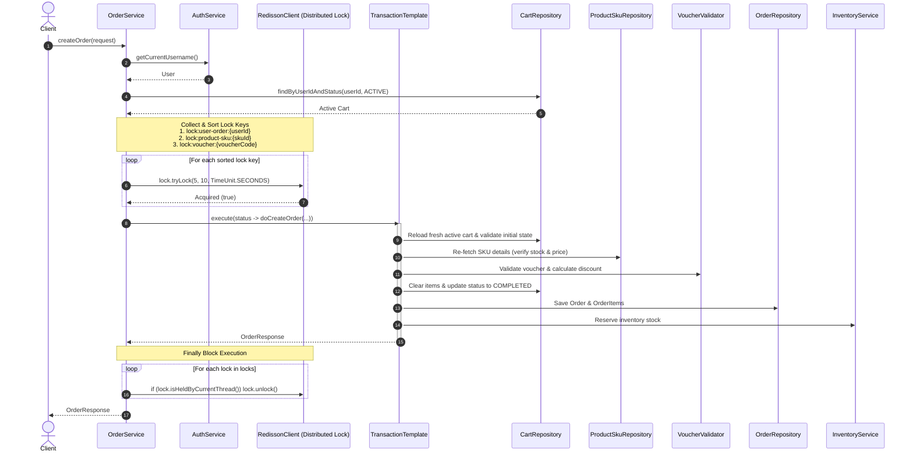

# Checkout & Distributed Transaction Flow

> Reference snapshot: verify relevant symbols against current code and tests.

## 1. Happy Path Execution Sequence

The order checkout pipeline is coordinated by `OrderService.createOrder(CreateOrderRequest)` using Redisson distributed locks and Spring's `TransactionTemplate`.

---

## 2. Step-by-Step Logic Breakdown

1. **Authentication & Cart Retrieval**:
   - Resolves current user via `authService.getCurrentUsername()`.
   - Fetches active cart using `cartRepository.findByUserIdAndStatus(user.getId(), CartStatus.ACTIVE)`.
2. **Lock Key Assembly & Sorting**:
   - Key 1: User submission lock (`lock:user-order:<userId>`).
   - Key 2: Product SKU stock locks (`lock:product-sku:<skuId>`).
   - Key 3: Voucher oversell lock (`lock:voucher:<voucherCode>`).
   - Keys are deduplicated and sorted lexicographically to prevent deadlocks across concurrent requests.
3. **Lock Acquisition**:
   - Invokes `lock.tryLock(5, 10, TimeUnit.SECONDS)` for each lock key in sequence.
4. **Transactional Execution (`TransactionTemplate.execute`)**:
   - Re-validates cart state to guarantee item quantities haven't mutated between lock request and acquisition.
   - Re-fetches `ProductSku` from DB to verify active status and adequate stock.
   - Applies voucher rules via `VoucherValidator`.
   - Clears cart items and updates cart status to `CartStatus.COMPLETED`.
   - Persists `Order`, `OrderItem`, and `OrderStatusHistory`.
   - Reserves inventory via `inventoryService.reserveInventory(...)`.
5. **Lock Release in `finally` Block**:
   - Iterates through acquired locks and releases each via `if (lock.isHeldByCurrentThread()) { lock.unlock(); }`.

---

## 3. Failure Conditions & Compensating Actions

| Failure Scenario | Exception / Code | Trigger Condition | Compensating Action / Rollback Mechanism |
|---|---|---|---|
| **Lock Acquisition Timeout** | `SYSTEM_BUSY` (1044) | Any `lock.tryLock(5, 10, TimeUnit.SECONDS)` returns `false` | Execution halts immediately. Any previously acquired locks in the sorted list are unlocked in the `finally` block via `lock.unlock()`. No DB transaction is opened. |
| **Cart Concurrent State Mutation** | `SYSTEM_BUSY` (1044) | Cart quantities during `doCreateOrder` do not match `initialSkuQtyMap` | Throws `AppException(SYSTEM_BUSY)`. `TransactionTemplate` triggers DB rollback. All Redisson locks released in `finally`. |
| **Invalid / Unowned Shipping Address** | `ADDRESS_NOT_BELONG_TO_USER` (1036) | Selected `addressId` does not belong to user | Throws `AppException`. DB transaction rolls back. All Redisson locks released in `finally`. |
| **Insufficient Product Stock** | `PRODUCT_STOCK_INVALID` (1015) / `INSUFFICIENT_STOCK` (1032) | `cartItem.quantity > sku.stock` | Throws `AppException`. DB transaction rolls back. All Redisson locks released in `finally`. |
| **Voucher Invalid / Expired / Limit Reached** | `VOUCHER_EXPIRED` (1024) / `VOUCHER_ARE_OUT` (1025) | Voucher fails validation rules | Throws `AppException`. DB transaction rolls back. All Redisson locks released in `finally`. |
| **Uncaught Runtime Exception** | `SYSTEM_ERROR` (1045) | Any unhandled exception or DB integrity constraint failure | Caught in `createOrder` `catch (Exception e)`. If `e instanceof AppException`, it is re-thrown directly; otherwise re-thrown as `SYSTEM_ERROR`. DB transaction rolls back automatically via `TransactionTemplate`. All Redisson locks released in `finally`. |
