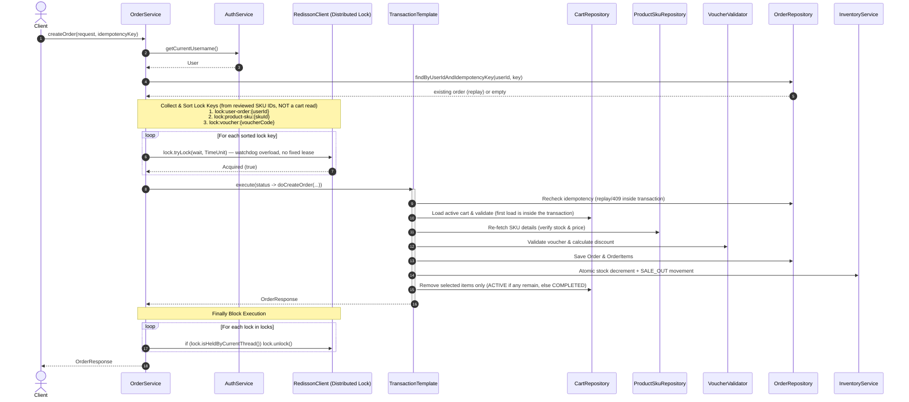

# Checkout & Distributed Transaction Flow

> Reference snapshot: verify relevant symbols against current code and tests.

## 1. Happy Path Execution Sequence

The order checkout pipeline is coordinated by `OrderService.createOrder(CreateOrderRequest, String idempotencyKey)` using Redisson distributed locks and Spring's `TransactionTemplate`.

## 2. Step-by-Step Logic Breakdown

1. **Authentication & Idempotency**:
   - Resolves current user via `authService.getCurrentUsername()`.
   - Computes the canonical request hash (length-prefixed `create-order:v2`
     representation including `saveAddress`) and replays or conflicts before
     any cart read.
2. **Lock Key Assembly & Sorting**:
   - Key 1: User submission lock (`lock:user-order:<userId>`).
   - Key 2: Product SKU stock locks (`lock:product-sku:<skuId>`) derived from
     the reviewed SKU IDs only — the cart is NOT read to build lock keys.
   - Key 3: Voucher oversell lock (`lock:voucher:<voucherCode>`).
   - Keys are deduplicated and sorted lexicographically to prevent deadlocks
     across concurrent requests.
3. **Lock Acquisition**:
   - Invokes `lock.tryLock(wait, TimeUnit)` (watchdog overload, no fixed
     10-second lease) for each lock key in sequence. Partial failure releases
     already-acquired locks in reverse order.
4. **Transactional Execution (`TransactionTemplate.execute`)**:
   - Rechecks idempotency inside the transaction.
   - Loads the active cart for the first time inside the transaction and
     validates the selection (no pre-lock OSIV read).
   - Recomputes the authoritative checkout and semantic-compares it with the
     reviewed snapshot (`CHECKOUT_CHANGED` 409 on mismatch).
   - Resolves address, persists `Order`, `OrderItem`, and `OrderStatusHistory`
     with authoritative amounts only.
   - Atomically decrements stock with a guard and writes a `SALE_OUT` stock
     movement. `OrderItem` is the committed quantity source; no separate
     inventory allocation is written (ADR-003).
   - Applies the voucher guarded increment and writes the canonical `REDEEMED`
     redemption without a `voucher_user` row (ADR-004), then removes selected cart
     items (cart stays `ACTIVE` if items remain, else `COMPLETED`).
5. **Lock Release in `finally` Block**:
   - Iterates through acquired locks and releases each via
     `if (lock.isHeldByCurrentThread()) { lock.unlock(); }`.

## 3. Failure Conditions & Compensating Actions

| Failure Scenario | Exception / Code | Trigger Condition | Compensating Action / Rollback Mechanism |
|---|---|---|---|
| **Lock Acquisition Timeout** | `SYSTEM_BUSY` (1044) | Any `lock.tryLock(wait, TimeUnit)` returns `false` | Execution halts immediately. Any previously acquired locks in the sorted list are released in reverse order. No DB transaction is opened. |
| **Idempotency Key Reuse** | `IDEMPOTENCY_KEY_REUSED` (1067) | Same `(user_id, idempotency_key)` with a different request hash | Returns 409 before any mutation. Inside the transaction, the recheck also 409s; a concurrent unique-constraint hit reloads the winner and replays-or-conflicts with bounded retry. |
| **Checkout Changed Since Review** | `CHECKOUT_CHANGED` (1068) | Any order-affecting value (selected SKU set, cart quantity, unit price, line totals, voucher identity/applicability, monetary outcome, `canPlaceOrder=false`) differs from the reviewed snapshot | `CheckoutChangedException` carries the latest review in `ApiResult.result`. The transaction rolls back; no mutation is committed. |
| **Invalid / Unowned Shipping Address** | `ADDRESS_NOT_BELONG_TO_USER` (1036) | Selected `addressId` does not belong to user | Throws `AppException`. DB transaction rolls back. All Redisson locks released in `finally`. |
| **Insufficient Product Stock** | `INSUFFICIENT_STOCK` (1032) | Atomic conditional decrement `stock >= quantity` updates 0 rows | Throws `AppException`. DB transaction rolls back any prior stock movement written in the same transaction. All Redisson locks released in `finally`. |
| **Voucher Invalid / Expired / Limit Reached** | `VOUCHER_EXPIRED` (1024) / `VOUCHER_ARE_OUT` (1025) | Voucher fails validation rules, or the guarded increment/redemption fails | Throws `AppException`. DB transaction rolls back stock, order, and cart together. All Redisson locks released in `finally`. |
| **Uncaught Runtime Exception** | `SYSTEM_ERROR` (1045) | Any unhandled exception or DB integrity constraint failure | Caught in `createOrder`; `AppException` is re-thrown directly, otherwise re-thrown as `SYSTEM_ERROR`. DB transaction rolls back automatically via `TransactionTemplate`. All Redisson locks released in `finally`. |
