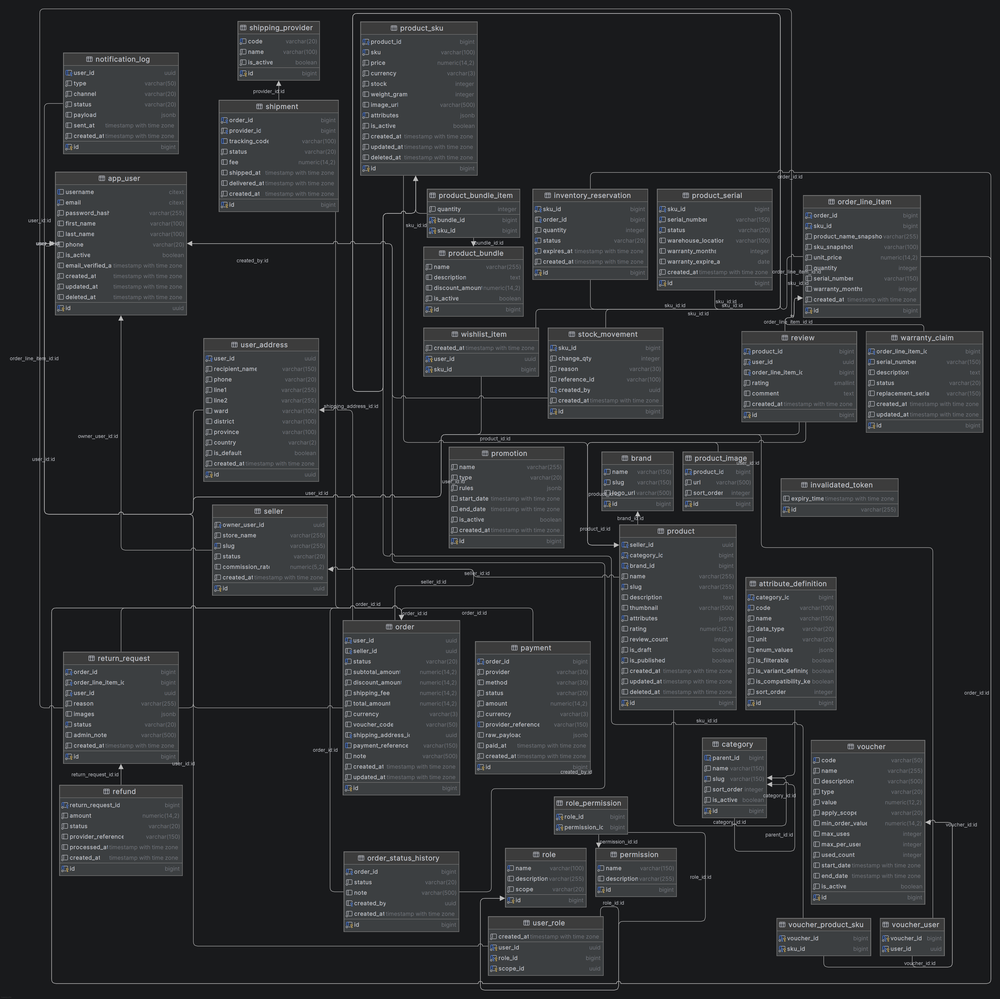

# 🛒 ABTechZone - Spring Boot E-commerce API

[](https://spring.io/projects/spring-boot)
[](https://www.oracle.com/java/technologies/downloads/)
[]()
[](LICENSE)

A RESTful E-commerce Backend built with **Spring Boot 3** following Clean Architecture principles.
This project is being developed as a personal portfolio to practice backend development.

> 🚧 **Project Status:** In Development
---

## 📂 Database Architecture & System Design

###  ERD

<div align="center">
  
  <p><i>ERD</i></p>
</div>

---

## ✨ Features

### Authentication & Authorization

* [ ] User Registration
* [ ] Login with JWT
* [ ] Refresh Token
* [ ] Role-based Authorization (ADMIN / CUSTOMER)

### User

* [ ] User Profile
* [ ] Address Management
* [ ] Change Password

### Product

* [ ] Product CRUD
* [ ] Category Management
* [ ] Product Search
* [ ] Product Pagination & Sorting

### Shopping Cart

* [ ] Add Product to Cart
* [ ] Update Quantity
* [ ] Remove Item
* [ ] Checkout

### Order

* [ ] Create Order
* [ ] Order History
* [ ] Order Status

### Voucher

* [ ] Voucher CRUD
* [ ] Apply Voucher

### Admin

* [ ] Dashboard
* [ ] User Management
* [ ] Product Management
* [ ] Order Management

---

## 🛠 Tech Stack

* Java 21
* Spring Boot 3
* Spring Security
* Spring Data JPA (Hibernate)
* MySQL
* JWT Authentication
* Maven
* Lombok
* MapStruct *(planned)*
* Docker *(planned)*
* Swagger / OpenAPI *(planned)*

---

## 📂 Project Structure

```text
src
├───main
│   ├───java
│   │   └───spring
│   │       └───abtechzone
│   │           ├───common               # Shared Kernel: Global code shared across modules
│   │           │   ├───config           # Global Caching, Security, and OpenAPI Configurations
│   │           │   ├───constant         # Enums and System-wide Constants
│   │           │   ├───dto              # Centralized Response Models (e.g., APIResponse<T>)
│   │           │   ├───exception        # Centralized Error Handling via @ControllerAdvice
│   │           │   └───util             # Helper Classes (JWT Token Providers, Encryption)
│   │           └───modules              # Bounded Contexts: Independent Core Business Modules
│   │               ├───auth             # Authentication & Token Management
│   │               │   ├───controller, dto, entity, mapper, repository, service, specification, validator
│   │               ├───cart             # Shopping Cart Business Logic
│   │               │   ├───constant, controller, dto, entity, mapper, repository, service
│   │               ├───inventory        # Isolated Stock and Inventory Allocation
│   │               │   └───entity
│   │               ├───order            # Order Lifecycle & Concurrent Transaction Handling
│   │               │   ├───constant, controller, dto, entity, mapper, repository, service
│   │               ├───product          # Product Catalog, Categories, and Variants (SKUs)
│   │               │   ├───controller, dto, entity, mapper, repository, service, specification, validator
│   │               ├───user             # Customer Profiles and Address Management
│   │               │   ├───controller, dto, entity, mapper, repository, service, specification, validator
│   │               └───voucher          # Coupon and Discount Calculation Engine
│   │                   ├───constant, controller, dto, entity, mapper, repository, service, specification, validator
│   │   └───resources                    # Houses application.yml and Database Migrations
└───test                                 # Automated Test Suite partitioned strictly by module
    ├───java
    │   └───spring
    │       └───abtechzone
    │           ├───cart
    │           ├───order
    │           ├───product
    │           └───voucher
    └───resources
```

---

## 🚀 Getting Started

### Clone project

```bash
git clone https://github.com/DuyAnh3223/springboot-ecommerce.git
```

### Run database

Configure your MySQL connection in:

```properties
application.yml
```

### Run project

```bash
mvn spring-boot:run
```

or

```bash
./mvnw spring-boot:run
```

---

## 📌 Development Roadmap

* [x] Project Initialization
* [x] Authentication
* [ ] User Module
* [ ] Product Module
* [ ] Category Module
* [ ] Cart Module
* [ ] Order Module
* [ ] Voucher Module
* [ ] Payment Integration
* [ ] Docker
* [ ] Unit Testing
* [ ] CI/CD
* [ ] Deployment

---

## 📖 API Documentation

Coming soon...

Swagger UI:

```
http://localhost:8080/swagger-ui/index.html
```

---

## 📸 Screenshots

Coming soon...

---

## 🧪 Testing

Coming soon...

---

## 📄 License

This project is created for learning and portfolio purposes.

---

## 👨‍💻 Author

**Duy Anh**

GitHub: https://github.com/DuyAnh3223
