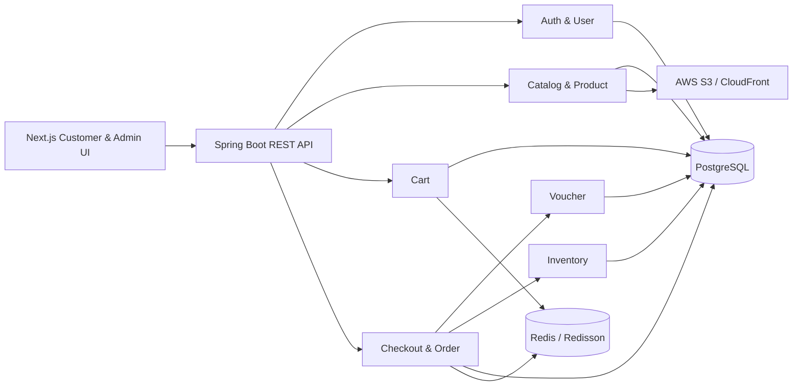
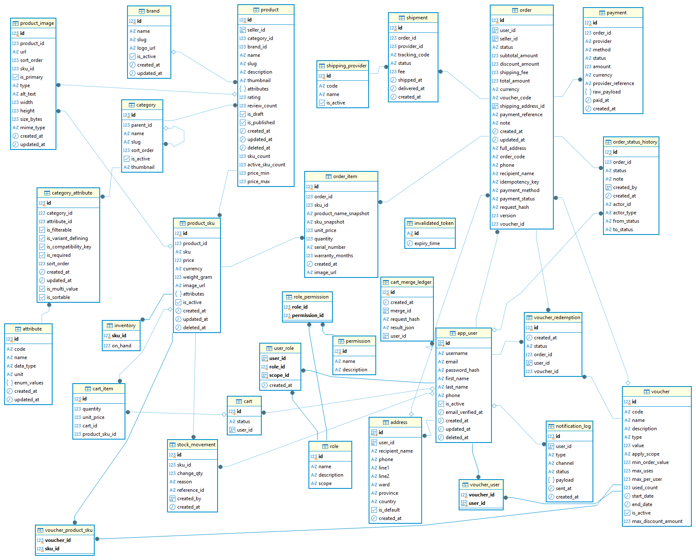

# 🛒 ABTechZone

ABTechZone is a full-stack e-commerce platform for technology products. The project combines a Spring Boot modular backend with a Next.js customer/admin frontend and focuses on reliable checkout, order, voucher, and inventory workflows.


> 🚧 **Project status:** Active development. Checked items are implemented in the current codebase; unchecked items are documented future work.

## 📚 Table of Contents

- [System Overview](#-system-overview)
- [Key Engineering Highlights](#-key-engineering-highlights)
- [Entity Relationship Diagram](#-entity-relationship-diagram)
- [Technology Stack](#-technology-stack)
- [Project Structure](#-project-structure)
- [System Modules & Key Features](#-system-modules--key-features)
- [Getting Started](#-getting-started)
- [Verification Status](#-verification-status)

## 🏗️ System Overview


```mermaid
flowchart LR
    UI[Next.js Customer & Admin UI] --> API[Spring Boot REST API]
    API --> AUTH[Auth & User]
    API --> CATALOG[Catalog & Product]
    API --> CART[Cart]
    API --> CHECKOUT[Checkout & Order]
    CHECKOUT --> VOUCHER[Voucher]
    CHECKOUT --> INVENTORY[Inventory]
    AUTH --> POSTGRES[(PostgreSQL)]
    CATALOG --> POSTGRES
    CART --> POSTGRES
    CHECKOUT --> POSTGRES
    VOUCHER --> POSTGRES
    INVENTORY --> POSTGRES
    CART --> REDIS[(Redis / Redisson)]
    CHECKOUT --> REDIS
    CATALOG --> AWS[AWS S3 / CloudFront]
```

The backend is organized by business module. PostgreSQL stores transactional data, while Redis/Redisson coordinates distributed locking and guest-cart merge retries. Customer-facing catalog responses read stock from the Inventory module, and checkout recalculates price, voucher, and stock on the server before creating an order.

## ✨ Key Engineering Highlights

| Engineering challenge                    | Implementation                                                                                                        | Practical guarantee                                                                                       |
| ---------------------------------------- | --------------------------------------------------------------------------------------------------------------------- | --------------------------------------------------------------------------------------------------------- |
| **Server-authoritative checkout**        | Reloads cart ownership, SKU price, product state, Inventory, voucher rules, and shipping fee                          | Browser-supplied totals cannot become persisted truth                                                     |
| **Stale checkout detection**             | Recomputes the review after locks are acquired and compares semantic snapshots                                        | Price/stock/voucher/cart changes return `CHECKOUT_CHANGED` instead of silently creating a different order |
| **Atomic order boundary**                | Writes Order, OrderItem, history, Inventory movement, VoucherRedemption, and selected-cart cleanup in one transaction | Partial database success is rolled back                                                                   |
| **Retry-safe order creation**            | UUID idempotency key + canonical payload hash + database uniqueness                                                   | Same request returns the same Order; key reuse with other input is rejected                               |
| **Oversell prevention**                  | Deterministic Redisson locking plus conditional SQL stock decrement                                                   | A stale read alone cannot drive `onHand` below zero                                                       |
| **Single inventory source of truth**     | `Inventory.onHand` owns persisted stock; Product/SKU responses delegate to it                                         | Catalog, cart, checkout, and order use the same stock authority                                           |
| **Auditable stock lifecycle**            | Typed movement reasons including `SALE_OUT` and `ORDER_CANCEL_RETURN`                                                 | Supported stock mutations leave a transactional ledger entry                                              |
| **Exact-once cancellation compensation** | Locked Order transition, immutable OrderItem quantity, voucher redemption state                                       | Repeated/concurrent cancellation does not intentionally return stock or quota twice                       |
| **Concurrency-safe voucher usage**       | Atomic usage update with global/per-user conditions and redemption ledger                                             | Competing checkouts cannot all consume the final quota                                                    |
| **Durable guest-cart merge**             | Request normalization/hash, Redis/Redisson coordination, unique merge ledger, per-item results                        | Login retries do not duplicate merged quantities or silently lose rejected items                          |
| **Immutable order history**              | Product, SKU, price, quantity, recipient, address, and voucher snapshots                                              | Later catalog/profile changes do not rewrite historical orders                                            |
| **Customer/admin contract separation**   | Owner-scoped customer queries and explicit admin transitions                                                          | Order visibility and actions follow actor-specific boundaries                                             |
| **Flexible catalog attributes**          | PostgreSQL JSONB with specification-based filtering and facet metadata                                                | Dynamic product attributes can be filtered without a column per attribute                                 |
| **Cloud media delivery**                 | AWS S3 object storage and CloudFront URL integration                                                                  | Product media is separated from application/database storage                                              |

## 🗄️ Entity Relationship Diagram

The ERD documents the main persisted entities and their relationships. The current source remains authoritative when the diagram and implementation differ.



[Open the full-size ERD](server/docs/erd.png)

## 🧰 Technology Stack

### Backend

- Java 21 and Spring Boot 4.0.6.
- Spring Web MVC and Bean Validation.
- Spring Security, OAuth2 Resource Server, Nimbus JWT, and BCrypt.
- Spring Data JPA/Hibernate and MapStruct.
- PostgreSQL 15 and JSONB through Hypersistence Utils.
- Redis and Redisson distributed locks.
- AWS S3 and CloudFront.
- JUnit 5, Mockito, Spring Boot Test, Testcontainers, and JaCoCo.

### Frontend

- Next.js 16 App Router, React 19, and TypeScript strict mode.
- Tailwind CSS 4, shadcn/base-ui, and Lucide icons.
- Axios, Zustand, React Hook Form, and Zod.
- Focused Node test harnesses for guest cart, checkout, orders, and product detail.

### Infrastructure

- Docker Compose for PostgreSQL, Redis, backend, and frontend services.
- GitHub Actions image build/push and commit-SHA deployment to EC2.
- Spring Actuator health endpoint and configurable Swagger/OpenAPI.
- Hibernate schema update is currently used; versioned database migrations remain future work.

## 📁 Project Structure

```text
ABTechZone/
├── client/                         # Next.js customer/admin frontend
│   ├── app/                        # App Router pages and layouts
│   ├── features/                   # Feature-owned UI, services, actions, types
│   ├── shared/                     # Shared HTTP and utility boundaries
│   └── test/                       # Focused frontend flow tests
├── server/                         # Spring Boot backend
│   ├── src/main/java/.../modules/
│   │   ├── auth/                   # JWT, roles, permissions
│   │   ├── user/                   # Profile and address book
│   │   ├── category/               # Category management
│   │   ├── product/                # Product, SKU, attributes, images
│   │   ├── catalog/                # Customer-safe catalog queries
│   │   ├── cart/                   # Cart and guest merge
│   │   ├── voucher/                # Discount rules and redemption
│   │   ├── order/                  # Checkout, creation, lifecycle
│   │   └── inventory/              # On-hand stock and movements
│   ├── src/test/                   # Unit and integration tests
│   └── docs/                       # ERD and backend documentation
├── .agents/                        # Specs, ADRs, plans, rules, and skills
├── docker-compose.yml
└── docker-compose.prod.yml
```

Payment, Shipment, and Notification do not yet have standalone backend packages.

## 🧩 System Modules & Key Features

### 1. Auth & User Management

Manages identity, authentication, authorization, customer profiles, roles, permissions, and delivery addresses.

- **Core Features:**
  - [x] **Account registration:** Create a customer account with username and password.
  - [x] **Authentication:** Verify credentials and issue a signed JWT.
  - [x] **Token lifecycle:** Introspect, refresh, and invalidate tokens on logout.
  - [x] **Role-based access control:** Model roles and permissions and protect admin operations.
  - [x] **Customer profile:** Read and update personal information.
  - [x] **Admin user management:** Search, view, and disable user accounts.
  - [x] **Address book:** Create, update, delete, list, and select a default delivery address.
  - [ ] **Email registration and verification:** Collect a valid email and verify ownership before sensitive actions.
  - [ ] **Dedicated password security flow:** Verify the current password, change/reset credentials, and revoke active sessions.

- **Key Technical Handling & Edge Cases:**
  - [x] **[Duplicate identity] Username already exists:** Reject the request through service validation and database uniqueness.
  - [x] **[Invalid credentials] Wrong username or password:** Reject authentication without issuing a token.
  - [x] **[Logged-out token reuse] A revoked JTI is submitted again:** Check the invalidated-token store and reject the token.
  - [x] **[Refresh replay] The old JWT is reused after refresh:** Blacklist the old JTI before issuing the replacement token.
  - [x] **[Address ownership] A user targets another customer's address:** Scope address operations to the authenticated owner.
  - [x] **[Default address deletion] The default address is removed:** Promote another existing address when available.
  - [ ] **[Disabled-account login] An inactive or soft-deleted user signs in:** Validate account state before issuing a JWT.
  - [ ] **[Privilege escalation] A customer includes admin roles in a profile update:** Separate self-profile and admin-role commands and authorize before mutation.
  - [ ] **[Concurrent default selection] Two addresses become default:** Enforce the one-default-address invariant at the database/locking boundary.

---

### 2. Catalog, Product & Category

Provides the product-management model for administrators and a sellability-safe catalog for customers.

- **Core Features:**
  - [x] **Product management:** Create, update, soft-delete, publish, and unpublish products.
  - [x] **SKU management:** Create and update product variants with independent code, price, state, and attributes.
  - [x] **Variant generation:** Preview Cartesian SKU combinations and reconcile variants in bulk.
  - [x] **Catalog browsing:** List and view published products through customer-safe endpoints.
  - [x] **Search and filtering:** Filter by category, brand, price, availability, and JSONB attributes.
  - [x] **Sorting and pagination:** Return stable pageable catalog results.
  - [x] **Catalog facets:** Expose filterable attribute and brand metadata.
  - [x] **Category, brand, and attribute management:** Maintain catalog classification data.
  - [x] **Product media:** Store images in S3 and serve them through CloudFront URLs.
  - [ ] **Complete category hierarchy:** Support parent assignment, nested traversal, and cycle prevention through the public contract.

- **Key Technical Handling & Edge Cases:**
  - [x] **[Invalid publication] A product has no active SKU:** Reject publication until at least one sellable SKU exists.
  - [x] **[Hidden product] A product or SKU is draft/inactive:** Exclude it from the canonical customer catalog.
  - [x] **[Duplicate SKU] An existing SKU code is reused:** Reject the mutation through uniqueness checks.
  - [x] **[Invalid price] A negative SKU price is submitted:** Reject the request through validation.
  - [x] **[Missing inventory] A SKU has no Inventory row:** Fail closed instead of showing unlimited stock.
  - [x] **[Deleted catalog data] Product/SKU is soft-deleted:** Keep historical references while preventing new sales through the catalog path.
  - [x] **[Primary image consistency] Product images are changed:** Maintain primary-image selection and synchronize stored media.
  - [ ] **[Legacy endpoint exposure] A non-canonical product endpoint returns draft data:** Unify its authorization and sellability rules with `CatalogService`.
  - [ ] **[Large catalog search] Filters become slow at scale:** Add query-plan monitoring, purpose-built indexes, caching, or a search engine based on measured queries.

---

### 3. Cart

Manages the authenticated shopping cart, selected-item checkout, and recovery of a guest cart after login.

- **Core Features:**
  - [x] **Cart operations:** View, add, update, remove, and clear cart items.
  - [x] **Duplicate SKU accumulation:** Increase the existing item quantity instead of creating a second logical item.
  - [x] **Price refresh:** Synchronize current SKU prices when the cart is loaded.
  - [x] **Partial checkout:** Allow the customer to select only specific cart items for checkout.
  - [x] **Guest-cart merge:** Batch-merge locally stored items after authentication.
  - [x] **Per-item merge result:** Return `MERGED` or `REJECTED` without silently discarding rejected local items.
  - [ ] **Cart expiration and cleanup:** Expire abandoned carts and remove stale records safely.

- **Key Technical Handling & Edge Cases:**
  - [x] **[Invalid quantity] Quantity is zero or negative:** Reject it through request/service validation.
  - [x] **[Insufficient stock] Requested quantity exceeds `onHand`:** Reject the cart mutation using Inventory data.
  - [x] **[Merge retry] The same merge ID is submitted again:** Replay the durable result using a unique ledger entry.
  - [x] **[Merge ID conflict] A merge ID is reused with another payload:** Compare the request hash and return a conflict.
  - [x] **[Partial merge] Some guest items are invalid:** Merge valid items and preserve rejected items with reason codes.
  - [x] **[Concurrent guest merge] Requests race for one user/cart:** Coordinate with Redis cache, Redisson locks, a transaction, and a durable merge ledger.
  - [ ] **[Unsellable direct add] A draft/inactive product or SKU is added directly:** Apply the same sellability policy used by guest merge and checkout.
  - [ ] **[Concurrent cart creation] Two requests create active carts:** Enforce one active cart per user at the database/locking boundary.
  - [ ] **[Duplicate database item] Two rows represent one cart/SKU:** Add unique, `NOT NULL`, and positive-quantity database constraints.

---

### 4. Voucher

Manages voucher configuration and calculates trusted discounts during checkout and order creation.

- **Core Features:**
  - [x] **Voucher administration:** Create, update, activate, deactivate, and query vouchers.
  - [x] **Global and product-specific scope:** Apply discounts to the full order or eligible products only.
  - [x] **Percentage and fixed discounts:** Support both calculation types and an optional maximum discount.
  - [x] **Minimum order value:** Require an eligible subtotal before applying a voucher.
  - [x] **Global and per-user usage limits:** Enforce voucher quotas at order creation.
  - [x] **Redemption ledger:** Associate successful redemption with one order.
  - [x] **Cancellation reversal:** Reverse redemption and return quota when an eligible order is cancelled.
  - [ ] **Campaign analytics and risk rules:** Measure conversion, detect abuse, and manage campaigns at scale.

- **Key Technical Handling & Edge Cases:**
  - [x] **[Code formatting] The customer enters mixed-case/space-padded code:** Normalize the code before validation.
  - [x] **[Inactive or expired voucher] The validity window is not satisfied:** Return a typed voucher issue without trusting the client.
  - [x] **[Ineligible items] A scoped voucher targets other products:** Calculate discount from the eligible subtotal only.
  - [x] **[Discount overflow] Discount exceeds eligible/order value:** Clamp the result so the payable amount cannot become negative.
  - [x] **[Last voucher race] Concurrent orders consume the remaining quota:** Use an atomic conditional update inside the order transaction.
  - [x] **[Repeated cancellation] Voucher compensation is requested again:** Use redemption state to prevent a second reversal.
  - [ ] **[Distributed campaign load] A high-traffic campaign overloads the database:** Introduce measured cache/queue/rate controls with reconciliation.

---

### 5. Checkout

Builds a server-authoritative review of selected cart items and protects order creation from stale or manipulated client data.

- **Core Features:**
  - [x] **Selected-item review:** Review only normalized SKU IDs selected from the authenticated cart.
  - [x] **Trusted price calculation:** Reload current SKU prices instead of accepting money values from the browser.
  - [x] **Stock validation:** Check fresh Inventory data before the customer places an order.
  - [x] **Voucher preview:** Recalculate voucher eligibility and discount on the server.
  - [x] **Shipping fee calculation:** Apply the configured server-side shipping fee.
  - [x] **Saved or inline address:** Create an order with an owned saved address or a validated inline address.
  - [x] **Customer-facing issue codes:** Return structured item/voucher problems for the checkout UI.
  - [ ] **Dynamic shipping and tax:** Calculate fee/tax from address, carrier, service, and pricing rules.
  - [ ] **Signed checkout session:** Persist/version a short-lived reviewed context when the workflow requires it.

- **Key Technical Handling & Edge Cases:**
  - [x] **[Client price tampering] A request submits altered totals:** Ignore client money and recompute authoritative totals.
  - [x] **[Foreign cart item] A selected SKU is not in the user's cart:** Reject it during cart resolution.
  - [x] **[Stale product state] Product/SKU becomes unsellable:** Return a typed issue and prevent order creation.
  - [x] **[Stock changes after review] Quantity is no longer available:** Recheck inside the locked order-creation flow.
  - [x] **[Voucher changes after review] Eligibility or quota changes:** Recalculate before persistence.
  - [x] **[Stale checkout snapshot] Price, cart, voucher, or address meaning changes:** Return `409 CHECKOUT_CHANGED` with the latest review.
  - [x] **[Deadlock-prone selection] Multiple SKU locks are needed:** Normalize, deduplicate, and sort identifiers before acquiring locks.
  - [ ] **[Online-payment wait] Stock must be held before payment finishes:** Add an accepted allocation/reservation policy before enabling the gateway flow.

---

### 6. Order

Creates immutable order records, exposes customer/admin order views, and controls the COD order lifecycle and cancellation compensation.

- **Core Features:**
  - [x] **Atomic order creation:** Persist order, items, history, stock movement, voucher redemption, and cart cleanup in one transaction.
  - [x] **Idempotent submission:** Require a canonical UUID idempotency key for create-order retries.
  - [x] **Immutable item snapshots:** Store product name, SKU code, unit price, quantity, and monetary values at purchase time.
  - [x] **Immutable delivery snapshot:** Store recipient, phone, address, and voucher data on the order.
  - [x] **Customer order history/detail:** Provide owner-scoped pagination, filters, detail, and allowed transitions.
  - [x] **Customer cancellation:** Allow cancellation from the permitted state with a validated reason.
  - [x] **Admin order management:** Search/filter orders, view details, and execute allowed transitions.
  - [x] **COD lifecycle:** Support `PENDING`, `CONFIRMED`, `SHIPPING`, `DELIVERED`, and `CANCELLED`.
  - [ ] **Return and refund workflows:** Support partial/full return, refund reasons, approval, and audit history.
  - [ ] **Split fulfillment:** Allocate one order across multiple shipments or warehouses.

- **Key Technical Handling & Edge Cases:**
  - [x] **[Double click or retry] The same request is submitted repeatedly:** Return the original order for the same key/payload.
  - [x] **[Idempotency conflict] The same key carries a different payload:** Compare the canonical request hash and return a conflict.
  - [x] **[Concurrent checkout] Orders compete for SKU/voucher resources:** Acquire deterministic Redisson locks before entering the transaction.
  - [x] **[Oversell] A stale stock read is followed by a sale:** Use Inventory's atomic conditional decrement as the final boundary.
  - [x] **[Catalog deletion] Product data changes after purchase:** Read order history from immutable snapshots.
  - [x] **[Unauthorized access] A user requests another customer's order:** Use owner-scoped repository/service queries.
  - [x] **[Invalid transition] An actor skips or reverses a lifecycle state:** Enforce actor-specific transitions with `OrderTransitionPolicy`.
  - [x] **[Concurrent/repeated cancellation] Compensation may run twice:** Lock the order row, treat terminal state idempotently, and compensate once.
  - [x] **[Compensation failure] Stock or voucher reversal fails:** Fail closed and roll back the cancellation transaction.
  - [ ] **[Cross-service failure] Payment/shipment becomes asynchronous:** Add outbox/inbox, saga policy, reconciliation, and observability.

---

### 7. Inventory

Owns the persisted on-hand quantity for each SKU and records every supported stock mutation in an audit ledger.

- **Core Features:**
  - [x] **Single stock authority:** Store sellable quantity only in `Inventory.onHand`.
  - [x] **Inventory lookup:** Read stock by SKU and batch-read stock for catalog products.
  - [x] **Atomic sale deduction:** Decrease stock only when enough quantity remains.
  - [x] **Cancellation return:** Restore committed quantity from immutable order items.
  - [x] **Opening balance:** Create the initial audited quantity for a SKU.
  - [x] **Admin adjustments:** Increase, decrease, or adjust to a desired quantity with an explicit reason.
  - [x] **Movement history:** Query a stable newest-first ledger by SKU/reason.
  - [ ] **Inventory reservation:** Hold, expire, commit, and release stock for future online-payment workflows.
  - [ ] **Multi-warehouse inventory:** Track physical stock, allocation, and availability per location.

- **Key Technical Handling & Edge Cases:**
  - [x] **[Missing Inventory row] A catalog SKU has no stock record:** Fail closed and report zero/unavailable stock.
  - [x] **[Negative stock] Concurrent sales request more than available:** Use conditional SQL `onHand >= quantity`.
  - [x] **[Integer overflow] A stock increase exceeds the supported range:** Reject the operation before corrupting quantity.
  - [x] **[Lost update] Sale and admin adjustment race:** Combine atomic updates with pessimistic locking for the adjustment flow.
  - [x] **[Ambiguous adjustment] A signed delta hides direction:** Require a positive quantity plus explicit increase/decrease direction.
  - [x] **[Unaudited mutation] Stock changes without history:** Write the typed `StockMovement` in the same transaction.
  - [x] **[Duplicate cancellation] Returned stock could be credited twice:** Couple return to the locked terminal Order transition.
  - [ ] **[Adjustment retry] An admin request is delivered twice:** Add an idempotency key and durable result for adjustment commands.
  - [ ] **[Ledger drift] Current balance differs from movements:** Add balance-before/after data and a reconciliation job with alerts.

---

### 8. Payment

The current project supports COD state inside Order. A standalone payment module and online gateway workflow are planned.

- **Core Features:**
  - [x] **COD method:** Create orders with `PaymentMethod.COD`.
  - [x] **COD status update:** Mark payment `PAID` when the order reaches `DELIVERED`, or `CANCELLED` when the order is cancelled.
  - [ ] **Payment aggregate:** Store payment identity, order, amount, method, status, and provider reference.
  - [ ] **Payment attempts:** Track multiple attempts without creating multiple successful charges.
  - [ ] **Online gateway integration:** Integrate VNPAY/Momo or another provider behind an adapter.
  - [ ] **Refund workflow:** Record and reconcile full/partial refunds.

- **Key Technical Handling & Edge Cases:**
  - [ ] **[Amount tampering] Client payment amount differs from Order:** Always derive payment amount from the server-owned Order total.
  - [ ] **[Duplicate callback] A provider sends the same event repeatedly:** Verify signature and deduplicate by provider event/reference.
  - [ ] **[Late success] Payment succeeds after timeout/cancellation:** Apply an explicit late-success and inventory-compensation policy.
  - [ ] **[Out-of-order status] Provider events arrive in the wrong order:** Enforce a payment state machine and monotonic transitions.
  - [ ] **[Lost callback] The provider succeeds but the application receives nothing:** Reconcile pending attempts with the provider.
  - [ ] **[Partial failure] Payment succeeds while Order update fails:** Use durable events/outbox and retry-safe processing.

---

### 9. Shipment

Order currently records coarse shipping states. Carrier integration, tracking, and shipment ownership are planned as a separate module.

- **Core Features:**
  - [x] **Order shipping states:** Transition a confirmed order to `SHIPPING` and then `DELIVERED`.
  - [ ] **Shipment aggregate:** Store carrier, service, tracking code, packages, and shipment status.
  - [ ] **Carrier integration:** Create/cancel shipments through a provider adapter.
  - [ ] **Tracking timeline:** Expose shipment events to customer and admin views.
  - [ ] **Delivery failure/return:** Model failed delivery, return-to-sender, and recovery actions.
  - [ ] **Split shipment:** Assign different order items to multiple packages.

- **Key Technical Handling & Edge Cases:**
  - [ ] **[Duplicate carrier webhook] The same tracking event is delivered again:** Store an idempotent provider event key.
  - [ ] **[Out-of-order event] Delivered arrives before picked-up:** Validate event ordering and allowed transitions.
  - [ ] **[Invalid tracking ownership] A user requests another shipment:** Scope shipment reads to the owning Order/customer.
  - [ ] **[Carrier timeout] Create-shipment result is unknown:** Retry safely, reconcile by client reference, and avoid duplicate labels.
  - [ ] **[Partial delivery] Only some packages are delivered:** Aggregate package states into the Order fulfillment status.

---

### 10. Notification

Notification delivery is planned. The first target is an in-app notification center driven by durable order events.

- **Core Features:**
  - [ ] **In-app notifications:** Create notifications for important order/payment/shipment events.
  - [ ] **Notification list:** Provide owner-scoped, paginated customer notifications.
  - [ ] **Read state:** Mark one or all notifications as read with a timestamp.
  - [ ] **Email/SMS/push channels:** Deliver selected events through external providers.
  - [ ] **Customer preferences:** Allow opt-in/opt-out by channel and event type.

- **Key Technical Handling & Edge Cases:**
  - [ ] **[Duplicate event] The same domain event is processed twice:** Deduplicate with an event/notification key.
  - [ ] **[Provider failure] Email/SMS/push delivery fails:** Retry with backoff and move exhausted messages to a dead-letter flow.
  - [ ] **[Transaction rollback] An Order event is emitted before commit:** Use a transactional outbox and publish only committed changes.
  - [ ] **[Unauthorized read] A customer opens another user's notification:** Enforce owner-scoped queries.
  - [ ] **[Notification flood] Repeated status changes spam a customer:** Apply event policy, batching, and channel preferences.

## 🚀 Getting Started

### Prerequisites

- Docker Desktop and Docker Compose, or Java 21 + Maven + Node.js/npm for running services separately.
- A root `.env` file containing the variables referenced by Docker Compose. The repository does not currently provide an `.env.example`.

Minimum local Compose configuration includes:

```dotenv
POSTGRES_USER=your_local_user
POSTGRES_PASSWORD=your_local_password
POSTGRES_DB=abtechzone
SPRING_PROFILES_ACTIVE=dev
JWT_SIGNER_KEY=replace_with_a_long_local_secret
REDIS_ADDRESS=redis://redis:6379
NEXT_PUBLIC_SPRING_API_URL=http://localhost:8080/abtechzone
```

AWS/CloudFront variables must also be configured when testing product-image functionality.

```powershell
docker volume create postgres_data
docker compose up --build
```

### Local URLs

- Frontend: `http://localhost:3000`
- Backend API: `http://localhost:8080/abtechzone`
- Swagger UI: `http://localhost:8080/abtechzone/swagger-ui.html`
- OpenAPI JSON: `http://localhost:8080/abtechzone/api-docs`

## 🧪 Verification Status

Latest documentation audit was performed on `dev@479a5b0` on 04-09-2026.

| Check                              | Result                            | Notes                                                                                                                         |
| ---------------------------------- | --------------------------------- | ----------------------------------------------------------------------------------------------------------------------------- |
| Backend `mvn clean test`           | **PASS**                          | 267 tests, 0 failures/errors/skips                                                                                            |
| Backend `mvn verify -Pintegration` | **NOT VERIFIED**                  | 38 integration tests could not initialize because Docker/Testcontainers was unavailable; assertions were not reached          |
| Frontend focused test harnesses    | **PASS**                          | 30/30 tests: guest cart, checkout, customer orders, admin orders, and product detail                                          |
| Frontend TypeScript                | **PASS WITH ENVIRONMENT NOTE**    | Source type-check passed after temporarily excluding a corrupted generated `.next/dev` cache; the original cache was restored |
| Frontend production build          | **PASS WITH ENVIRONMENT WARNING** | Build succeeded; static generation logged `ECONNREFUSED` because the local backend was not running                            |
| Frontend ESLint                    | **FAIL**                          | 194 findings: 131 errors and 63 warnings                                                                                      |
| Browser + live backend acceptance  | **UAT PENDING**                   | Not yet verified with the full UI, PostgreSQL, Redis, and backend runtime                                                     |

Automated checks provide implementation evidence; they do not replace manual acceptance of customer-visible and business-critical flows.

---
